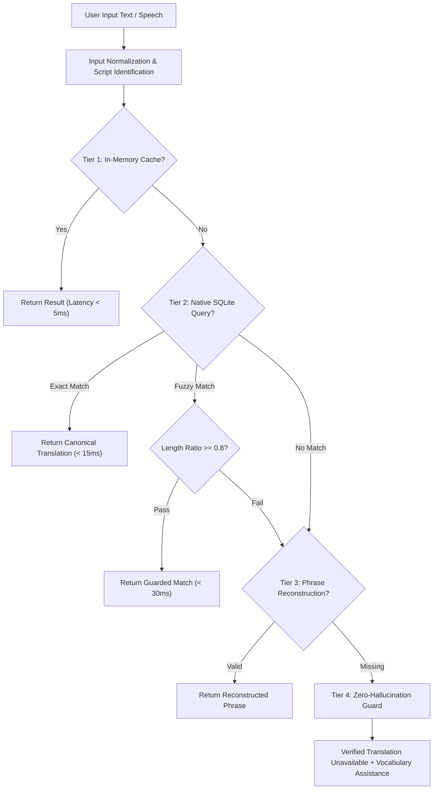

# 🏗️ BHASHA SETU — Flutter Migration Architecture

> **Architecture Style**: Clean Layered Architecture with Local-First Inversion of Control  
> **Target Framework**: Flutter (Dart 3.x) for Android (SDK 21 - 34)  
> **Source Platform**: React 18, TypeScript, SQLite WASM, IndexedDB  

---

## 1. Clean Layered Architecture Diagram

```
┌─────────────────────────────────────────────────────────────┐
│                    PRESENTATION LAYER                       │
│  - Flutter Screens (TextToText, S2S, OCR, LearningStudio)   │
│  - Reusable Brand Widgets (AppNavbar, LanguageSelectorBar)  │
│  - Controllers / Notifiers (Riverpod State Management)      │
└──────────────────────────────┬──────────────────────────────┘
                               │
                               ▼
┌─────────────────────────────────────────────────────────────┐
│                     APPLICATION LAYER                       │
│  - S2S Turn State Machine & Auto-Stop Controller            │
│  - Audio Pipeline & Downsampler (16 kHz Mono PCM)           │
│  - OCR Preprocessor & Capability Router                     │
│  - Video Subtitle Synchronizer & SRT/VTT Formatter          │
└──────────────────────────────┬──────────────────────────────┘
                               │
                               ▼
┌─────────────────────────────────────────────────────────────┐
│                       DOMAIN LAYER                          │
│  - TranslationDecisionEngine (4-Tier Resolution)            │
│  - DomainSafetyEngine (Zero-Hallucination Enforcer)         │
│  - OlChikiTransliterationEngine (Unicode U+1C50–U+1C7F)     │
│  - Entities & Value Objects (TranslationResult, TurnMeta)   │
└──────────────────────────────┬──────────────────────────────┘
                               │
                               ▼
┌─────────────────────────────────────────────────────────────┐
│                  DATA & INFRASTRUCTURE LAYER                │
│  - DatabaseService (Native sqflite wrapper for translations)│
│  - Native Speech-to-Text & Text-to-Speech Adapters          │
│  - Local File Storage & Asset Loaders                       │
│  - Optional Edge ApiClient (FastAPI Backend at Port 5000)   │
└─────────────────────────────────────────────────────────────┘
```

---

## 2. Directory & Module Organization

The target Flutter project in `D:/BASHA SETU/BhashaSetuFlutter` is organized as follows:

```
BhashaSetuFlutter/
├── android/                         # Android Studio native host project
│   ├── app/
│   │   ├── build.gradle             # Android build configs & minSdk 21
│   │   └── src/main/
│   │       ├── AndroidManifest.xml  # Audio, Camera, Storage permissions
│   │       └── res/                 # App launcher icons & splash
│   └── build.gradle                 # Root Gradle configuration
│
├── assets/                          # Bundled local offline assets
│   ├── database/
│   │   └── translations.db          # 6.22 MB master SQLite database (6,780 rows)
│   ├── data/
│   │   └── Santhali-Words.csv       # Master CSV lexicon
│   ├── fonts/
│   │   └── OlChiki-Regular.ttf      # Bundled Ol Chiki TrueType font
│   └── images/
│       └── logo.png                 # Bhasha Setu dual-script emblem
│
├── lib/
│   ├── main.dart                    # Application entrypoint & DB initialization
│   ├── app.dart                     # MaterialApp configuration & theme setup
│   │
│   ├── core/                        # Cross-cutting core utilities
│   │   ├── constants/               # Color tokens, script ranges & timeouts
│   │   ├── theme/                   # Brand theme (#238B45, rounded-20px)
│   │   ├── routing/                 # Named route table
│   │   └── utils/                   # Ol Chiki transliteration & string cleaners
│   │
│   ├── data/                        # Datasets & models
│   │   ├── models/                  # Language, TranslationRow, DictionaryEntry
│   │   └── datasets/                # Santali dataset, categories, sample phrases
│   │
│   ├── services/                    # Business logic & hardware abstractions
│   │   ├── database/                # Native SQLite service (sqflite)
│   │   ├── translation/             # 4-Tier Translation Decision Engine
│   │   ├── safety/                  # Domain Safety & zero-hallucination engine
│   │   ├── asr/                     # Speech-to-Text adapter
│   │   ├── tts/                     # Text-to-Speech & phonetic acoustic bridge
│   │   ├── s2s/                     # S2S Turn Controller & AutoStopController
│   │   ├── ocr/                     # Native OCR processor
│   │   ├── subtitle/                # Video subtitle exporter (.SRT, .VTT)
│   │   ├── connectivity/            # Network online/offline monitor
│   │   └── api/                     # Optional FastAPI REST client
│   │
│   ├── features/                    # Feature presentation screens
│   │   ├── home/                    # Landing page & interactive phone preview
│   │   ├── translation/             # Text-to-Text screen & language swap
│   │   ├── speech_to_speech/        # S2S dual-speaker conversation UI
│   │   ├── speech_to_text/          # Speech-to-Text transcription UI
│   │   ├── text_to_speech/          # TTS playground screen
│   │   ├── ocr/                     # Neural OCR scanner & translation UI
│   │   ├── video_subtitle/          # Video player & synchronized subtitle studio
│   │   ├── learning_studio/         # Flashcards, worksheets, quiz & certificates
│   │   ├── field_mode/              # Mobile high-contrast field interface
│   │   ├── teacher_mode/            # Projector high-visibility classroom mode
│   │   ├── emergency_mode/          # Rapid medical triage audio cards
│   │   ├── dictionary/              # Searchable 6,780-word lexicon
│   │   ├── knowledge_base/          # 12-domain categorized phrase explorer
│   │   ├── about/                   # About Us & institutional background
│   │   ├── contact/                 # Contact & feedback form
│   │   ├── auth/                    # Login modal & authentication
│   │   └── privacy/                 # Privacy Policy & data ethics
│   │
│   └── widgets/                     # Shared UI components
│       ├── navigation/              # Top floating navbar & bottom footer
│       └── common/                  # Buttons, badges, cards, dialogs
│
├── test/                            # Unit & integration test suites
│   ├── translation_test.dart        # Translation decision engine unit tests
│   ├── transliteration_test.dart    # Ol Chiki Unicode conversion tests
│   └── safety_guard_test.dart       # Zero-hallucination rejection tests
│
└── pubspec.yaml                     # Dependencies, assets & fonts declaration
```

---

## 3. Translation Decision Engine Specification



---

*Architecture Document Complete.*
