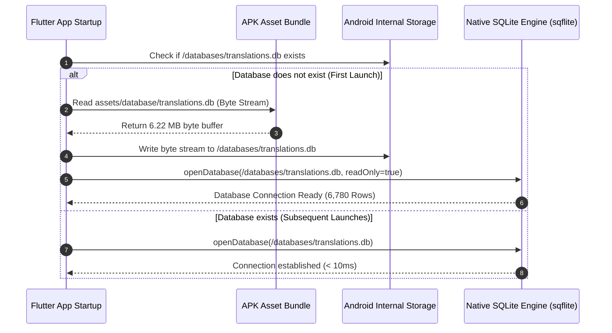

# 📴 BHASHA SETU — Offline-First Architecture for Android

> **Core Philosophy**: Zero Network Dependency for Core Indigenous Translation & Pedagogy  
> **Primary Target**: Remote Anganwadi Centers, Tribal Schools, Interior Forest Patrols  

---

## 1. Zero-Network Principle

Bhasha Setu is engineered from the ground up to operate completely disconnected from the internet. When an Android device is in Airplane Mode:
- **Text-to-Text Translation**: 100% functional via local native SQLite database.
- **Multilingual Dictionary**: 100% functional across 6,780 parallel verified records.
- **Verified Knowledge Base**: 100% functional across all 12 domains.
- **Learning Studio (Flashcards, Worksheets, Quizzes)**: 100% functional on-device.
- **Field Mode, Teacher Mode & Emergency Mode**: 100% functional with local audio alerts.

---

## 2. Local Storage & Asset Life Cycle



---

## 3. Online/Offline Hybrid State Management

The central `ConnectivityService` provides a stream of network availability:

```dart
enum NetworkState { online, offline }

class ConnectivityService {
  // Streams network status without blocking UI
  Stream<NetworkState> get onStatusChange;
  
  // Queries local SQLite first; only queries FastAPI backend if online AND enabled
  Future<TranslationResult> resolveTranslation({
    required String text,
    required String sourceLang,
    required String targetLang,
  });
}
```

### Local-First Inversion Rule:
1. Every query is executed against the **local native SQLite engine first**.
2. If an exact or high-confidence match is found locally, the result is returned immediately with `provenance: 'local_database'`.
3. The remote FastAPI backend is only contacted for optional cloud telemetry or differential sync when explicitly requested.

---

*Offline-First Architecture Specification Complete.*
