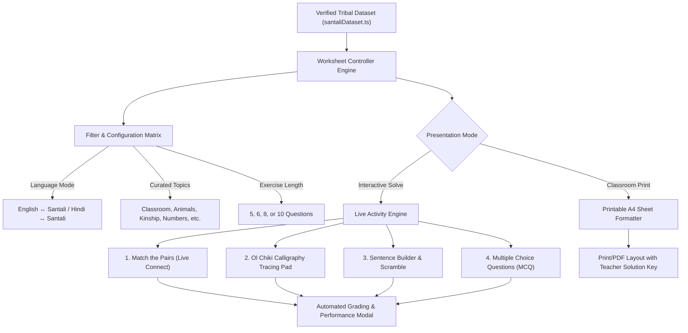
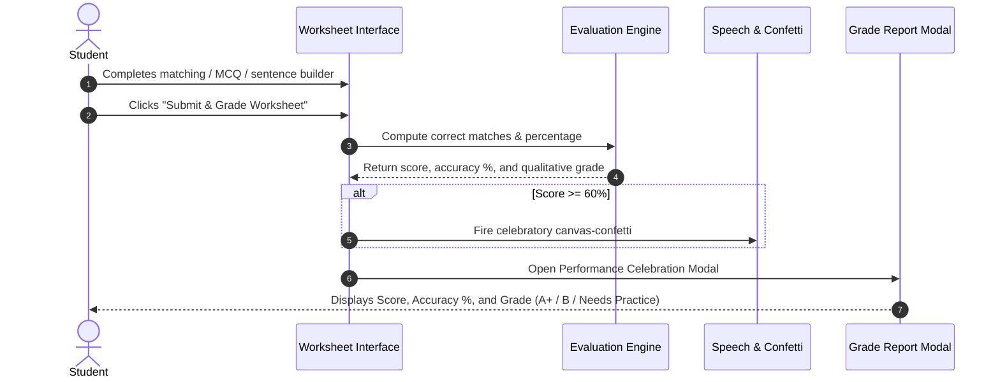

# Bhasha Setu Learning Studio: Worksheets & Exercise Engine Report

## 1. Executive Summary

The **Worksheet Studio** within Bhasha Setu's **Learning Studio** (`/features/learning-studio?tab=worksheets`) is a dual-paradigm educational engine engineered specifically for **migrant teachers, frontline educators, and tribal school students** in India. It bridges the critical linguistic divide between regional state curricula (Hindi / English) and indigenous tribal languages (specifically **Santali in the Ol Chiki script**, with romanized phonetic bridges).

Unlike conventional static worksheet generators, Bhasha Setu's Worksheet Studio functions as both a **live interactive digital practice environment** (for tablets, laptops, and classroom smartboards) and a **print-ready A4 test paper generator** (for low-resource, off-grid rural schools and Ashram Shalas).

---

## 2. Architectural Overview

---

## 3. Core Operating Modes

The Worksheet Studio operates under two distinct paradigms:

| Capability | Live Solve Mode (Interactive) | Printable A4 Sheet Mode |
| :--- | :--- | :--- |
| **Primary Target** | Digital classrooms, computer labs, student tablets | Offline rural schools, examinations, paper homework |
| **Interaction Model** | Mouse clicks, touch gestures, stylus tracing | Physical pen-and-paper writing |
| **Audio Feedback** | Instant one-click native Santali TTS playback | Romanized phonetic pronunciation guide printed |
| **Evaluation** | Real-time automated grading with score modals & confetti | Optional toggleable Teacher Solution Key |
| **Persistence** | In-memory session tracking & downloadable calligraphy PNGs | Standard browser print engine (`window.print()`) / PDF |

---

## 4. The 4 Interactive Exercise Engines

### 4.1. Match the Pairs (Live Connect)
- **Mechanics:** Dual-column matching interface. Column A presents prompts in English or Hindi; Column B presents randomly shuffled Santali Ol Chiki translations with italicized Roman phonetics.
- **Interaction:**
  1. Learner clicks an item in Column A (triggers highlighted green border and scale animation).
  2. Learner selects the corresponding option in Column B to bind the pair.
  3. Interactive badges indicate linkage status (`✓ Linked`).
  4. Users can unlink individual pairs or reset all connections with a single click.
- **Auditory Bridge:** Each card includes a dedicated audio button that speaks the Ol Chiki phrase using the integrated speech synthesis engine.

### 4.2. Ol Chiki Calligraphy Tracing Pad
- **Mechanics:** An HTML5 `<canvas>` digital calligraphy pad rendered at 2× device pixel ratio (high-DPI) to prevent pixelation on high-density displays.
- **Guidance Grid:** Renders horizontal baseline guidelines and a faint, 54px bold Ol Chiki watermark character template in the center.
- **Tool Palette:**
  - **Inks:** Forest Green (`#249144`), Royal Blue (`#1e40af`), Deep Black (`#0f172a`), Ruby Red (`#b91c1c`).
  - **Stroke Widths:** Fine (3px), Medium (6px), Calligraphy (12px) with round line caps and line joins.
  - **Actions:** Real-time character switching (Prev/Next), Eraser/Clear Canvas, and instant **Save PNG** export for student digital portfolios.

### 4.3. Sentence Builder & Scramble (Word Jumble)
- **Mechanics:** Syntactic reconstruction exercise where a target sentence meaning in English or Hindi is provided.
- **Tokenization:** The correct Santali sentence is tokenized into word chips and shuffled.
- **Solving Flow:**
  - Students click available word chips to assemble the sentence sequentially into a dashed construction zone.
  - Clicking a placed token removes it back to the available pool.
  - Clicking **"Check Answer"** validates syntactic order, delivers confetti animations upon success, displays the romanized pronunciation, and triggers speech playback.

### 4.4. Multiple Choice Questions (MCQ)
- **Mechanics:** Standardized assessment with automated distractor generation.
- **Distractor Pipeline:** Pulls distinct, category-appropriate entries from the verified dataset to generate 4 realistic choices (A, B, C, D) per question.
- **Immediate Playback:** Each prompt features an audio button so non-native teachers and students can verify phonetic pronunciation prior to answering.

---

## 5. Pedagogical Customization Matrix

The teacher or student can tailor every generated worksheet using four top-level parameter controls:

1. **Activity Type:**
   - `matching`: Match the Pairs (Live Connect)
   - `tracing`: Ol Chiki Calligraphy Tracing Pad
   - `scramble`: Sentence Builder & Scramble
   - `mcq`: Multiple Choice Translation
2. **Language Mode:**
   - `eng`: English $\leftrightarrow$ Santali (Ol Chiki)
   - `hin`: Hindi (हिन्दी) $\leftrightarrow$ Santali (Ol Chiki)
3. **Vocabulary Topics:**
   - Filters dynamically across curated categories, including:
     - *Classroom Everyday Expressions*
     - *Animals & Nature*
     - *Family & Kinship*
     - *Numbers & Counting*
     - *Food, Farming & Agriculture*
     - *Body Parts & Health*
4. **Exercise Length:**
   - 5 Questions (Quick Check)
   - 6 Questions (Standard Classroom Period)
   - 8 Questions (Medium Revision)
   - 10 Questions (Comprehensive Examination)

---

## 6. Evaluation & Assessment Workflow

### Grading Criteria
- **$\ge 80\%$:** `A+ (Excellent)` — Awarded with full confetti celebration.
- **$50\% - 79\%$:** `B (Good Effort)` — Encourages further revision.
- **$< 50\%$:** `Needs Practice` — Highlights opportunities for vocabulary reinforcement.

---

## 7. Printable A4 Classroom Test Paper Features

When switched to **Printable A4 Sheet Mode**, the page reformats into a formal government school examination document:
- **Official Header:** Features institutional headings (`GOVERNMENT OF INDIA • MINISTRY OF TRIBAL AFFAIRS • BHASHA SETU LINGUISTIC PORTAL`).
- **Student Metadata Block:** Pre-formatted fill-in lines for *Student Name*, *Class / Roll No*, *Date*, and *Score / Total*.
- **Standardized Question Sections:** Clean typography, bracketed answer boxes `[ ____ ]`, and high-contrast Ol Chiki fonts.
- **Print Optimization:** Injects `@media print` rules to strip all navigation bars, sidebars, buttons, and browser chrome, producing a crisp monochrome or color paper sheet.
- **Teacher Solution Key:** A toggleable answer key section for instructors, displaying the exact mapping (e.g., `1. Pen -> C (ᱚᱞᱟᱜ ᱚᱞ)`). Hidden during student printing.

---

## 8. Offline-First & Zero-Network Reliability

- **100% Client-Side Execution:** The worksheet generation, shuffling, distractor sampling, and canvas rendering execute entirely in the browser using the pre-compiled `SANTALI_DATASET`.
- **Zero Server Overhead:** Worksheets can be generated, customized, and printed in remote, off-grid schools without an active internet connection.
- **Cross-Device Compatibility:** Works seamlessly across standard desktop browsers, low-cost Android tablets, and interactive smartboards.
